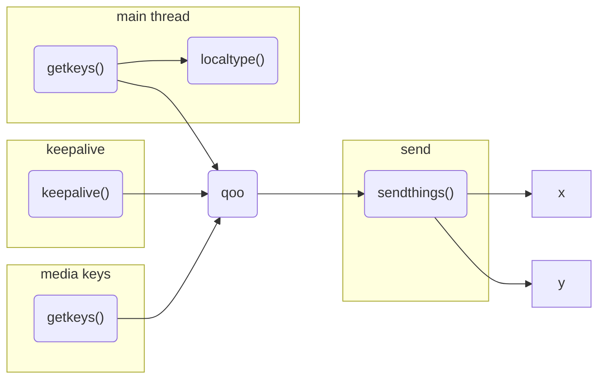
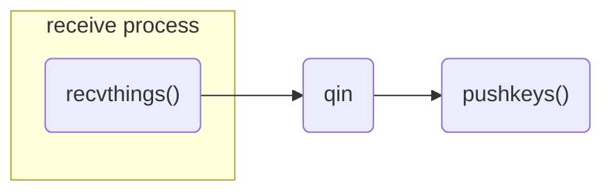

# keeb
keyboard sharing client and server

These scripts redirect keystrokes from one computer to another. The server is the computer that has the keyboard, and the client is the computer that receives the keystrokes. 

## Potential features

- on the fly macros
- 

## Message format

|mtype|data|
|---|---|
|0|keyup
|1| keydown
|2| keyhold
|3|keepalive
|4| change target (sender only)
|5| quit

## __serve.py__

## __linuxClient.py__

