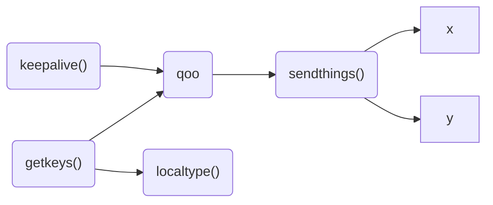
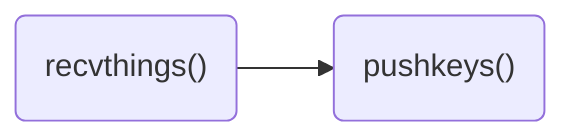

# keeb
keyboard sharing client and server

|mtype|data|
|---|---|
|0|keyup
|1| keydown
|2| keyhold
|3|keepalive
|4| change target (sender only)
|5| quit
|6| toggle scroll

### __serve.py__

### __client.py__

