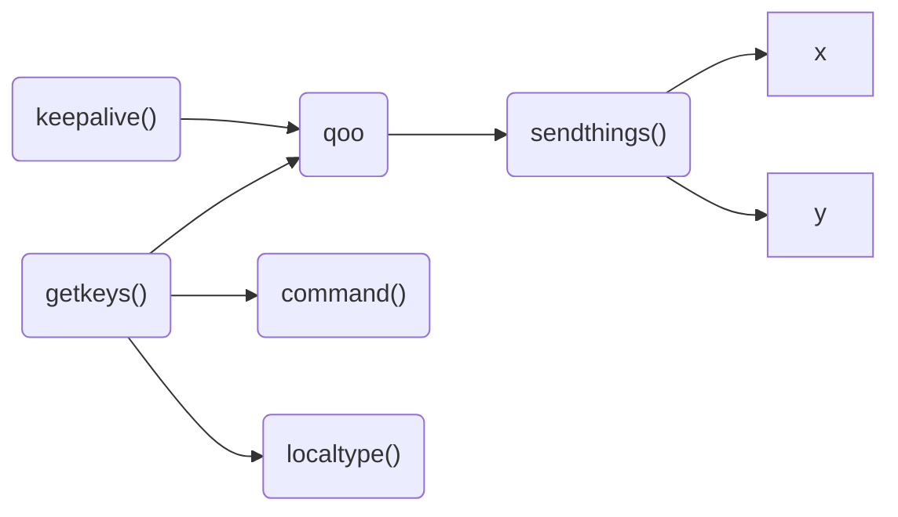

# keeb
keyboard sharing client and server

```mermaid
graph LR

gk("getkeys()")
ka("keepalive()")
qoo(qoo)
st("sendthings()")

lt("localtype()")
cmd("command()")

gk & ka --> qoo --> st
gk --> cmd
gk --> lt

st --> x & y

```
