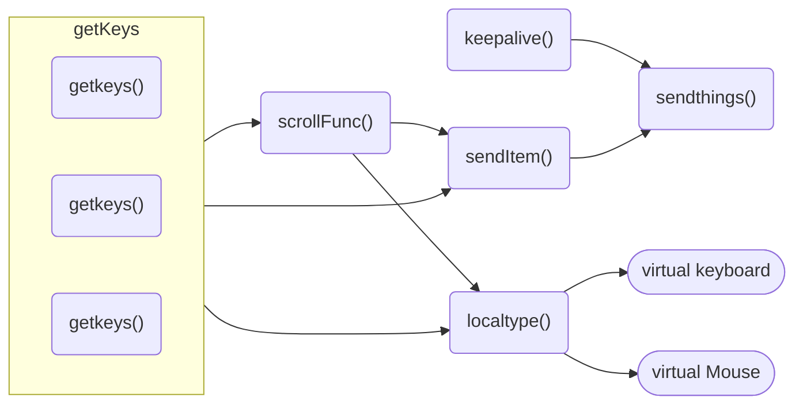

# keeb

keyboard and mouse sharing client and server

These scripts redirect keyboard and mouse inputs from a server machine to client machines.  

Target machines can be switched on the fly with a hotkey.  

This is very similar to [synergy](https://symless.com/synergy), although it enables altering or automating the behavior of the keyboard and mouse inputs.

## Usage

The primary use case for this is to use a raspberry pi "cyberdeck" as a keyboard for a PC.  This would also offer many possibilities for automation and customization.  

## Features

- Keyboard and mouse sharing
- Switch target machines on the fly
- Scroll mode for mouse inputs (scrolling is sent to the target machine)
- Volume control with mouse wheel in scroll mode
- Scroll mode can be local with __scrollmouse.py__

## Potential features

- on the fly macros
- keyboard mapping (remap keys on the fly)
- fuzzy logic autocomplete for all apps
    - python's fuzzywuzzy library would be perfect for this. 

## Requirements

|Linux Server|Linux Client|Windows Client|
|-|-|-|
|python3|python3|python3|
|evdev|evdev|pywin32|
|pyzmq|pyzmq|pyzmq|

### __asyncServer.py__

This runs on the machine that is sharing inputs.  It captures the keyboard and mouse inputs and sends them either to the client machines, or to the local machine.

### __asyncClient.py__

This runs on the target machines. It receives the inputs from the server and sends them to the virtual keyboard and mouse.

### __winClient.py__
Identical to asyncClient.py, but uses pywin32 instead of evdev.  This is for windows machines.

### scrollmouse.py
This provides __"scroll mode"__ functionality, but on a local computer.  

## Message Event Types

While it would be trivial to support all messege types, as of this writing only events to handle keyboard and mouse inputs are used.  

In addition to the standard evdev event types a keepAlive type is used to maintain a responsive connection.  This event type is not part of the evdev framework.  It is sent multiple times a second to maintain a responsive connection.  Without this constant stream the latency becomes highly variable.  

|Type|ENUM|Description|
|-|-|-|
|0|EV_SYN| This event type is used to synchronize and separate events. It doesn't represent a specific input event but is used to separate different events and indicate the end of a sequence of events.
|1| EV_KEY| This event type represents keyboard events, including key presses and releases. Each key press or release event has an associated keycode.
|2| EV_REL| This event type represents relative axis events. These events are generated by devices like mice and trackpads to indicate relative movement along different axes (X, Y, etc.).
|3| EV_ABS| This event type represents absolute axis events. Devices like touchscreens generate absolute position data, which is represented through this event type. It includes events for X and Y coordinates, pressure, and other absolute input values.
|4|EV_MSC| Miscellaneous input events. These are used for events that don't fit into other categories. Examples include events indicating device status changes.
|5| EV_SW| Switch events. These events indicate the state of switches on a device, such as the lid switch on a laptop.
|6| EV_LED| LED (Light Emitting Diode) events. These events are used to control the state of LEDs on input devices like keyboards.
|7| EV_SND| Sound events. These events are used for input related to sound, although they are not commonly used for standard input devices.
|8| EV_REP| Repeat events. These events are used to indicate that a key is being held down and is automatically repeating.
|9| EV_FF| Force Feedback events. These events are used for force feedback devices like rumble pads and force feedback joysticks.
|23|_keepAlive_|_These are not part of the __evdev__ framework.  These are sent multiple times a second to maintain a responsive connection._

